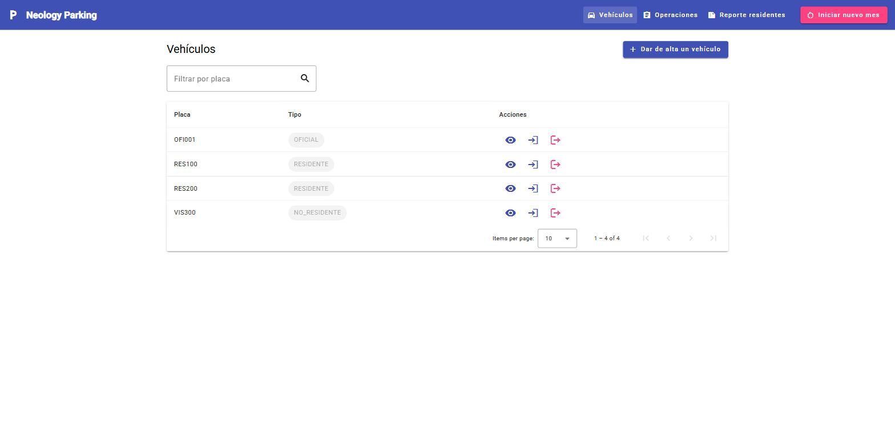
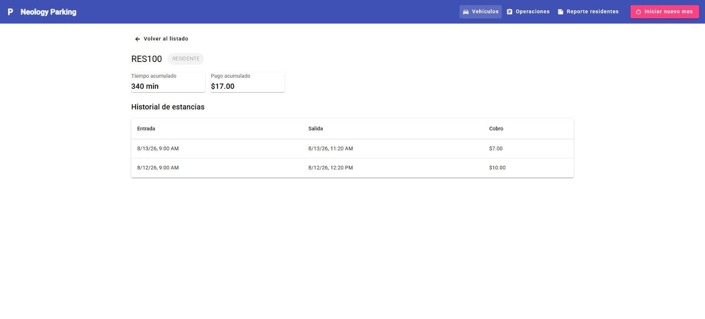
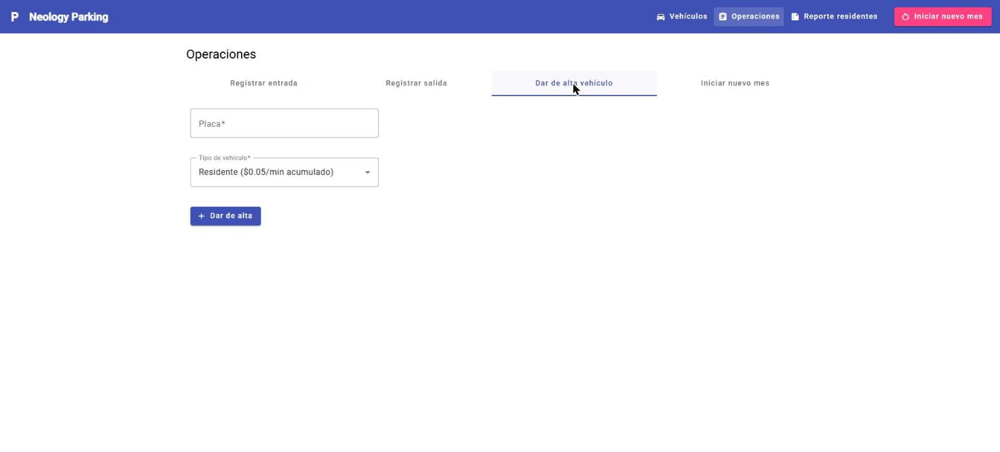
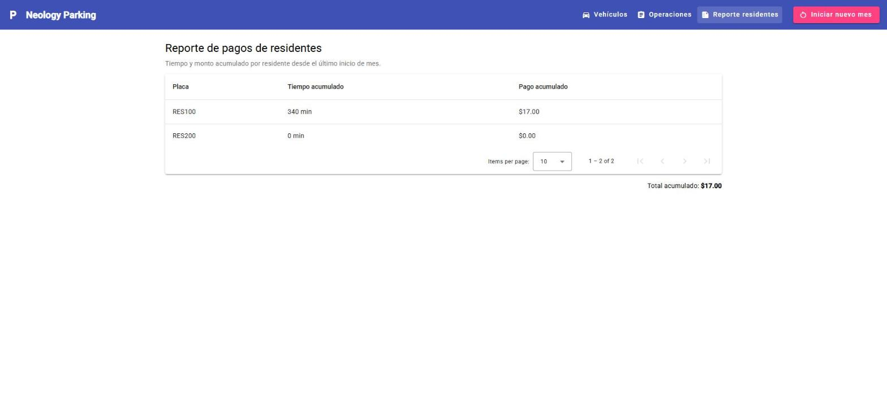

# Full-Stack-Prueba-tecnica-Neology

Sistema de gestión de estacionamiento — backend en **Spring Boot** + frontend en **Angular**.
Entrega de Alexis Molinero para la prueba técnica Full Stack de Neology.

## Índice

- [Estructura del repositorio](#estructura-del-repositorio)
- [Tecnologías](#tecnologías)
- [Cómo levantar el proyecto](#cómo-levantar-el-proyecto)
- [Datos de prueba (base precargada)](#datos-de-prueba-base-precargada)
- [Capturas de pantalla](#capturas-de-pantalla)
- [Enunciado original de la prueba técnica](#enunciado-original-de-la-prueba-técnica)

## Estructura del repositorio

```
├── parking-backend/    # API REST — Spring Boot 4 + Java 17 + JPA/Hibernate + H2
└── parking-frontend/   # SPA — Angular 16 + Angular Material
```

## Tecnologías

**Backend** (`parking-backend/`): Java 17, Spring Boot 4.1, Spring Data JPA / Hibernate, base de datos
H2 en memoria, Maven (con Maven Wrapper, no hace falta tener Maven instalado), Lombok, MapStruct
(mapeo entidad ↔ DTO) y springdoc-openapi para documentación Swagger.

**Frontend** (`parking-frontend/`): Angular 16, Angular Material, SCSS, RxJS, Jasmine/Karma para
pruebas unitarias.

## Cómo levantar el proyecto

### Requisitos previos

- **Java 17+** (para el backend — no hace falta instalar Maven, el repo trae el wrapper `mvnw` / `mvnw.cmd`)
- **Node.js 18+** y **npm** (para el frontend)

### 1. Backend

```bash
cd parking-backend
./mvnw spring-boot:run        # Linux/Mac
mvnw.cmd spring-boot:run      # Windows
```

Queda escuchando en **http://localhost:8080**, con `context-path=/neo`, o sea que todos los
endpoints cuelgan de `http://localhost:8080/neo/...` (ejemplo `GET http://localhost:8080/neo/vehiculos`).

Recursos extra disponibles mientras el backend corre:

- **Swagger UI**: http://localhost:8080/neo/swagger-ui/index.html
- **Consola H2**: http://localhost:8080/neo/h2-console — JDBC URL `jdbc:h2:mem:atlasbank`, usuario `prueba`, sin contraseña

### 2. Frontend

En otra terminal:

```bash
cd parking-frontend
npm install
npm start                     # equivale a `ng serve` → http://localhost:4200
```

El backend ya tiene configurado CORS (`CorsConfig.java`) para aceptar peticiones desde
`http://localhost:4200`, que es donde corre el frontend en desarrollo. Si lo sirves desde otro
origen/puerto hay que agregarlo ahí.

Con ambos corriendo, abre **http://localhost:4200** en el navegador.

## Datos de prueba (base precargada)

El backend trae un `data.sql` (`parking-backend/src/main/resources/data.sql`) que precarga datos de
ejemplo cada vez que arranca, para no tener que dar de alta todo a mano antes de poder ver algo en
pantalla:

| Placa    | Tipo         | Estado                                                             |
|----------|--------------|---------------------------------------------------------------------|
| `OFI001` | Oficial      | Con una estancia ya cerrada (no paga)                              |
| `RES100` | Residente    | Dos estancias cerradas — 340 min y $17.00 acumulados                |
| `RES200` | Residente    | Con una estancia **abierta** (recién entró, 0 acumulado todavía)    |
| `VIS300` | No residente | Con una estancia cerrada — pagó $15.00 por 30 min                   |

> La base es en memoria (`jdbc:h2:mem`) y el esquema se recrea en cada arranque
> (`spring.jpa.hibernate.ddl-auto=create-drop`), así que estos datos se reinsertan solos cada vez
> que reinicias el backend — cualquier cambio hecho desde la UI en una corrida anterior no persiste.
> Si prefieres arrancar con la base vacía, basta con borrar `data.sql` (o vaciar su contenido).

## Capturas de pantalla

**Listado de vehículos** — filtro por placa, paginación, ordenamiento y acciones rápidas de entrada/salida



**Detalle de vehículo** — historial de estancias y, si es residente, tiempo/pago acumulado



**Operaciones** — formularios de entrada, salida, alta de vehículo e inicio de nuevo mes



**Reporte de pagos de residentes**




## Enunciado original de la prueba técnica

Instrucciones de la prueba tecnica

La siguiente es una prueba para evaluar a los postulantes para un perfil de Full Stack.

### INTRODUCCIÓN
Este repositorio contiene una serie de requerimientos de un Caso Práctico, que busca evaluar las capacidades técnicas del candidato con respecto a las principales funciones y responsabilidades que se requieren dentro del área de Desarrollo de software de Neology.

### ¿Qué se busca evaluar?
Principalmente los siguientes aspectos:

* Creatividad para resolver los requerimientos.
* Uso de experiencia y conocimiento en base a buenas praticas.
* Eficiencia de los algoritmos entregados.
* Mostrar la experencía y la manera de poder salir de la caja para romper o identificar cualquier falla o mejora.
* Familiaridad con Frameworks y plataformas.


### Consideraciones al finalizar la prueba:
Enviar la prueba tecnica hacía el correo de la consultora y copiando la prueba al correo vmiranda@neology.mx y lluna@neopartners.mx.
Cumplir con los puntos que solicitan, hacer enfasis en el detalle de las interfaces.<br>
Clonar el proyecto y subirlo como una rama adicional.


### Instrucciones:
* Tiempo estimado: 5 horas
* Se espera que completes las tareas especificadas a continuación utilizando Angular & Spring Boot.
* La prueba se evaluará en función de la calidad del código, la organización, la atención al detalle y la precisión en la implementación de los requisitos.

### Objetivo General de la prueba Técnica:

Desarrollar un sistema web que permita gestionar el acceso de vehículos a un estacionamiento, con una interfaz frontend en Angular y una API backend en Spring Boot.<br>
El sistema debe registrar entradas y salidas, calcular cobros y mostrar reportes.


#### Parte 1 – Backend (Spring Boot):
### Tecnologías:
* Java 17+
* Spring Boot 3.x
* Maven
* Hibernate + JPA
* Base de datos H2 (en memoria)
* Lombok (opcional)
* Swagger (opcional)


#### 1. Endpoints requeridos:

* POST neo/vehiculos/oficiales: Alta de vehículo oficial
* POST neo/vehiculos/residentes: Alta de vehículo residente
* POST neo/vehiculos/no-residentes: Alta de vehículo no residente (opcional)
* POST neo/estancias/entrada: Registrar entrada de vehículo
* POST neo/estancias/salida: Registrar salida de vehículo
* GET neo/residentes/pagos: Generar informe de pagos
* POST neo/mes/iniciar: Reiniciar mes (reseteo de tiempos y estancias)

#### 2. Modelos principales:

* Vehículo (placa, tipo)
* Estancia (placa, fecha/hora entrada, fecha/hora salida)
* Residente (placa, tiempo acumulado)

#### 3. Reglas de negocio:

* Vehículos oficiales no pagan.
* Residentes pagan $0.05/minuto (acumulado).
* No residentes pagan $0.5/minuto al salir.
* El sistema debe permitir agregar fácilmente nuevos tipos de vehículos.

#### 4. Pruebas unitarias:

* Crear pruebas mínimas para los servicios más importantes (ej: cálculo de cobro, registro de estancias).


### Parte 2 – Frontend (Angular):
#### Tecnologías:
* Angular 16+
* Angular Material
* SCSS o CSS

#### 1. Requerimientos funcionales:

* Página de listado de vehículos (consumir desde el backend).<br>
Formulario para:
* Registrar entrada
* Registrar salida
* Dar de alta vehículo oficial o residente
* Iniciar nuevo mes

* Vista de detalle para cada vehículo (estancias, pagos acumulados si aplica).<br>
* Página de reporte de residentes (visualización de informe).

#### 2. Extras recomendados:

* Filtro por placa en el listado.
* Paginación y ordenamiento.
* Validación de campos.
* Prevenir XSS en campos de entrada.
* Pruebas unitarias básicas con Jasmine + Karma.
* Utiliza Angular Material para mejorar el diseño y la experiencia del usuario.

### Entrega:

#### Repositorio GitHub con:
* Proyecto Angular (frontend/)
* Proyecto Spring Boot (backend/)

#### Instrucciones claras en el README para:
* Levantar backend y frontend
* Realizar pruebas
* Base de datos precargada opcionalmente
* Capturas de pantalla del frontend funcionando
* Código bien organizado, modular, con buenas prácticas


Nota:
No te preocupes si no puedes completar todos los requisitos en el tiempo asignado. Se valorará el progreso y la calidad del trabajo realizado.
